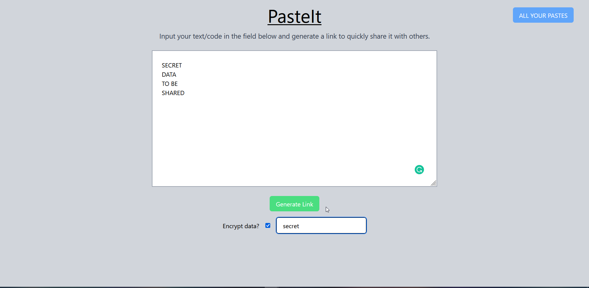
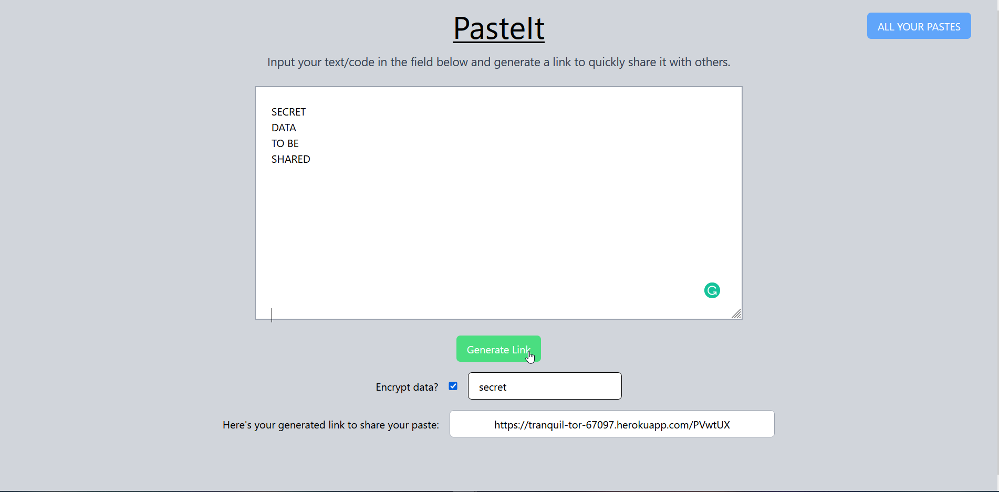
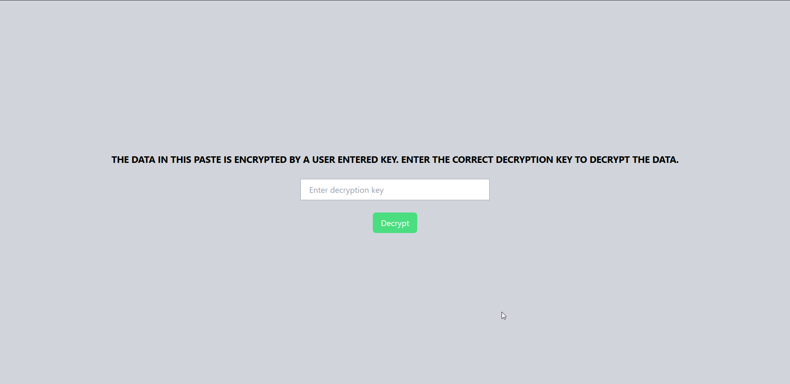
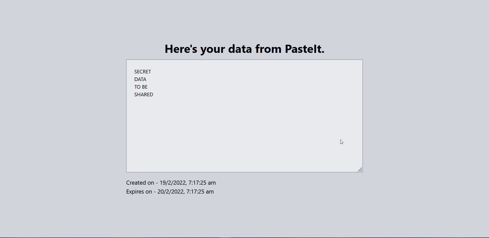
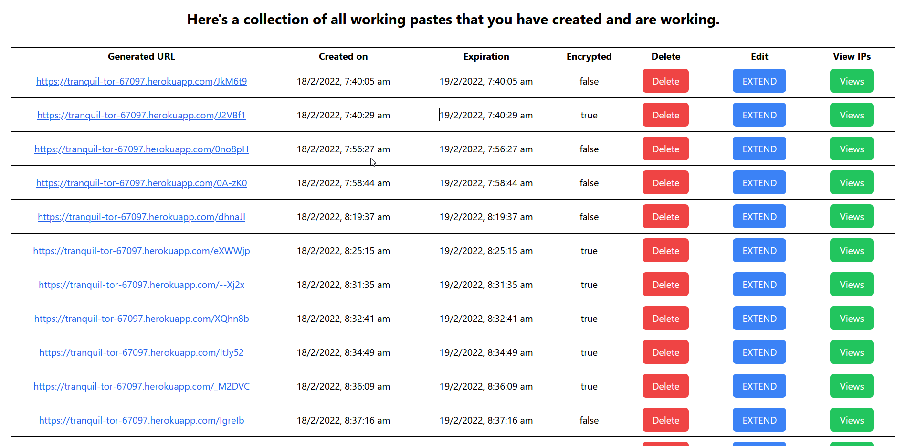
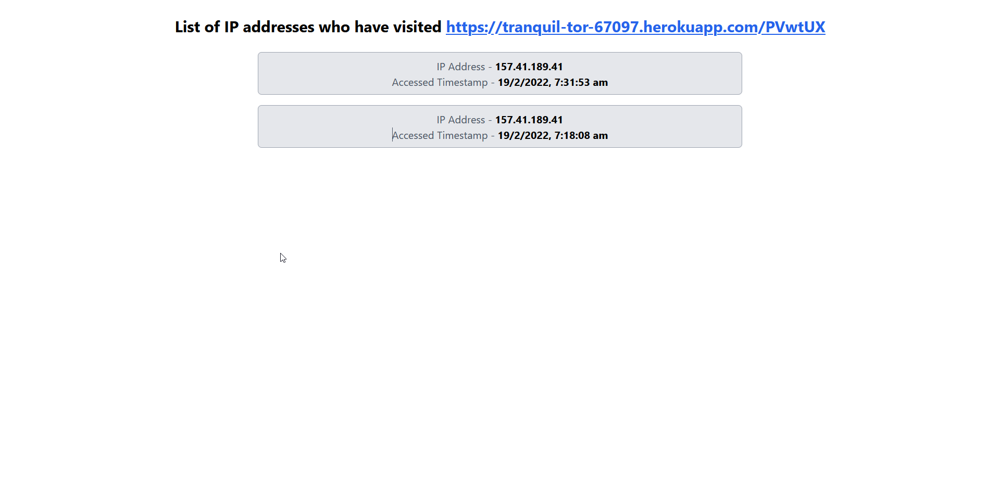

# PasteIt
## Easily generate links to share text, code snippets and other data with people with **PasteIt**!


---
## Project Structure
PasteIt's project files are divided into two repositories which follow a client-server architecture -

- Frontend - [pasteit-client](https://github.com/bigsbunny/pasteit-client)
- Backend (REST API) - [pasteit-api](https://github.com/bigsbunny/pasteit-api)

---

## Tech stack used
- Frontend - React.js + TailwindCSS
- Backend - Node.js, Express.js, MongoDB Atlas

---
## Implementation

- The frontend of the project is deployed on Heroku at the URL [https://tranquil-tor-67097.herokuapp.com/](https://tranquil-tor-67097.herokuapp.com/), which can be used to test the REST API created for the project, so as to match the instructions given in the project guidelines. 
- The frontend acts as the client to the REST API of PasteIt deployed on Heroku at [https://young-eyrie-03918.herokuapp.com/](https://young-eyrie-03918.herokuapp.com/), which sends requests with relevant data to the API and gets JSON response back from the API.

# How to setup PasteIt's frontend to test the API

>Clone the repository
```
git clone git@github.com:bigsbunny/pasteit-client.git
```
>Change directoty
```
cd pasteit-client
```
>Setup React
```
npm install
```
>Create a .env file at the root of the project and mention the following data in it
```
REACT_APP_SERVER_URL=http://localhost:3001
REACT_APP_CLIENT_URL=http://localhost:3000
```
>Start the React Live server
```
npm start
```
## **Make sure to spin up the server as well in order to the test the functionality of the API.**

## Interface Screenshots






